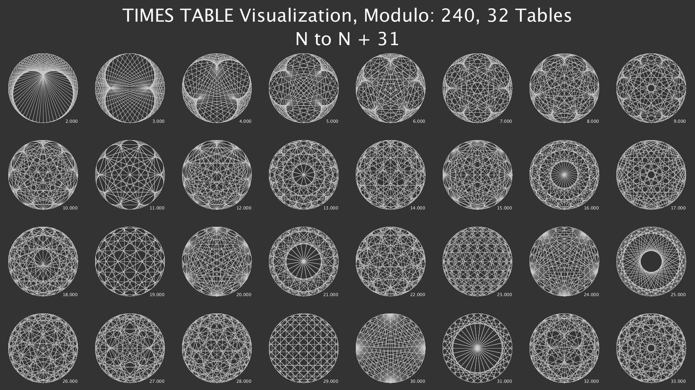
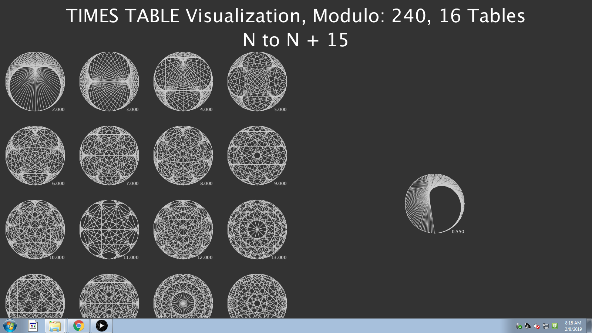

**The final product of my times table grid.**

I created this application by mapping N number of points around a circle of radius R, that N number of points is the modulo of the time tables.
I then use a for loop to draw a line from point i to point i * multiplier % modulo. 
the times tables are layed out in a grid that fits within a 16:9 screen.

**Controls**
````
 * left mouse to increase the multiplier by .1
 * right mouse to round the multiplier to a whole number
 * press r to reset
 * press any other key to reduce the multiplier by .1
````



The other version uses a 4x4 grid instead of a 8x4 grid and has one table on the right side that can be grown/shrunk


